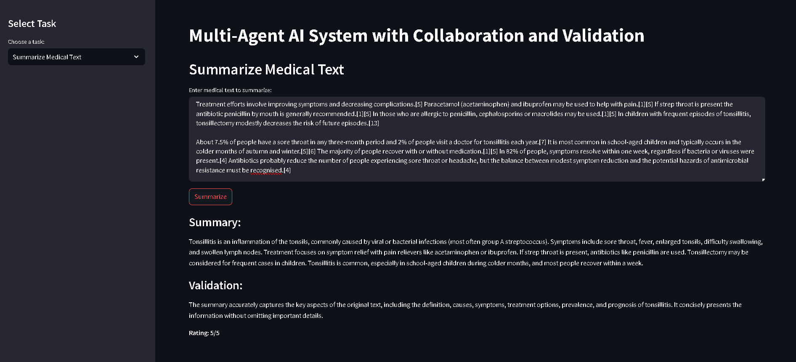
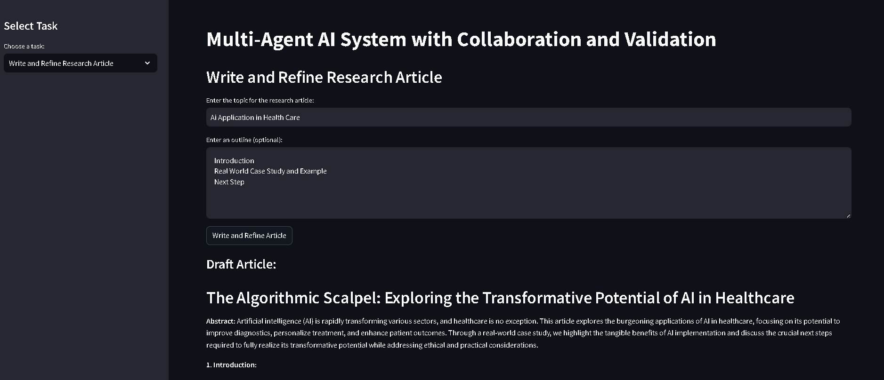
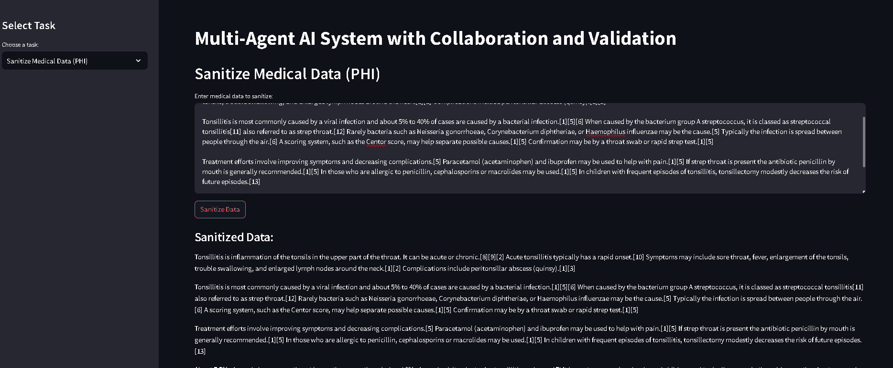

# Multi-Agents AI System from Scratch






## Table of Contents

- [Overview](#overview)
- [Features](#features)
- [Architecture](#architecture)
- [Installation](#installation)
- [Usage](#usage)
- [Agents](#agents)
  - [Main Agents](#main-agents)
  - [Validator Agents](#validator-agents)
- [Logging](#logging)
- [Contributing](#contributing)
- [License](#license)
- [Acknowledgements](#acknowledgements)

## Overview

The **Multi-Agents AI System from Scratch** is a Python-based application leveraging LangChain Google GenAI for powerful language processing, Streamlit for an interactive interface, and other libraries to ensure seamless data management and logging. It includes agents for summarizing medical texts, writing research articles, and sanitizing medical data (Protected Health Information - PHI). Each primary agent is paired with a validator agent for quality assurance.

## Features

- **Summarize Medical Texts:** Generate concise summaries of lengthy medical documents.
- **Write Research Articles:** Create detailed research articles based on a given topic and optional outline.
- **Sanitize Medical Data (PHI):** Remove sensitive health information from medical datasets.
- **Quality Validation:** Validator agents ensure the quality and accuracy of outputs.
- **Robust Logging:** Comprehensive logging with Loguru for monitoring and debugging.
- **User-Friendly Interface:** Streamlit-based web app for easy interaction.

## Architecture

The system follows a modular architecture where agents are paired with validator agents for quality control. The workflow is logged comprehensively for traceability.

## Installation

### Prerequisites

- **Python 3.9 or higher**: [Download Python](https://www.python.org/downloads/)
- **Google GenAI Access**: Ensure you have the required API credentials for LangChain Google GenAI.

### Steps

1. **Clone the Repository**

   ```bash
   git clone https://github.com/PriyanshuDey23/Multi-Agent-Systems.git
   cd Multi-Agents-System-from-Scratch
   ```

2. **Create a Virtual Environment**

   ```bash
   python3 -m venv venv
   source venv/bin/activate  # On Windows: venv\Scripts\activate
   ```

3. **Install Dependencies**

   ```bash
   pip install -r requirements.txt
   ```

4. **Set Up Environment Variables**

   Create a `.env` file in the project root:

   ```dotenv
   GOOGLE_GENAI_API_KEY=your-api-key-here
   ```

   Alternatively, set the environment variable directly:

   - **Unix/MacOS:**

     ```bash
     export GOOGLE_GENAI_API_KEY='your-api-key-here'
     ```

   - **Windows:**

     ```bash
     set GOOGLE_GENAI_API_KEY=your-api-key-here
     ```

## Usage

1. **Activate the Virtual Environment**

   ```bash
   source venv/bin/activate  # On Windows: venv\Scripts\activate
   ```

2. **Run the Streamlit App**

   ```bash
   streamlit run app.py
   ```

3. **Access the App**

   Open the URL provided by Streamlit (usually `http://localhost:8501`) in your web browser.

4. **Interact with the Tasks**

   - **Summarize Medical Text:** Input medical texts to receive concise summaries.
   - **Write and Refine Research Article:** Provide a topic and optional outline to generate and refine research articles.
   - **Sanitize Medical Data (PHI):** Input medical data to remove sensitive information.

## Agents

### Main Agents

- **Summarize Agent**
  - **Function:** Generates summaries of provided medical texts.
  - **Usage:** Input the text, and receive a concise summary.

- **Write Article Agent**
  - **Function:** Creates drafts of research articles based on a topic and optional outline.
  - **Usage:** Provide a topic and outline to generate an initial draft.

- **Sanitize Data Agent**
  - **Function:** Removes Protected Health Information (PHI) from medical data.
  - **Usage:** Input medical data containing PHI to receive sanitized data.

### Validator Agents

- **Summarize Validator Agent**
  - **Function:** Validates the accuracy and quality of summaries.
  - **Usage:** Receives the original text and its summary to assess quality.

- **Refiner Agent**
  - **Function:** Enhances and refines research article drafts for better clarity and coherence.
  - **Usage:** Receives a draft article and returns an enhanced version.

- **Sanitize Validator Agent**
  - **Function:** Ensures that all PHI has been removed from sanitized data.
  - **Usage:** Receives original and sanitized data to verify PHI removal.

## Logging

- **Location:** Logs are stored in the `logs/` directory.
- **Files:**
  - `multi_agent_system.log`: Contains detailed logs for monitoring and debugging.
- **Configuration:** Logging is handled using the `loguru` library.

## Contributing

Contributions are welcome! Please follow these steps:

1. **Fork the Repository**
2. **Create a Feature Branch**

   ```bash
   git checkout -b feature/YourFeature
   ```

3. **Commit Your Changes**

   ```bash
   git commit -m "Add your feature"
   ```

4. **Push to the Branch**

   ```bash
   git push origin feature/YourFeature
   ```

5. **Open a Pull Request**

## License

This project is licensed under the [MIT License](LICENSE).

## Acknowledgements

- [LangChain](https://langchain.com/) for integration with Google GenAI.
- [Streamlit](https://streamlit.io/) for the web application framework.
- [Pandas](https://pandas.pydata.org/) for efficient data manipulation.
- [Loguru](https://github.com/Delgan/loguru) for robust logging.
- [Python Dotenv](https://github.com/theskumar/python-dotenv) for environment variable management.
